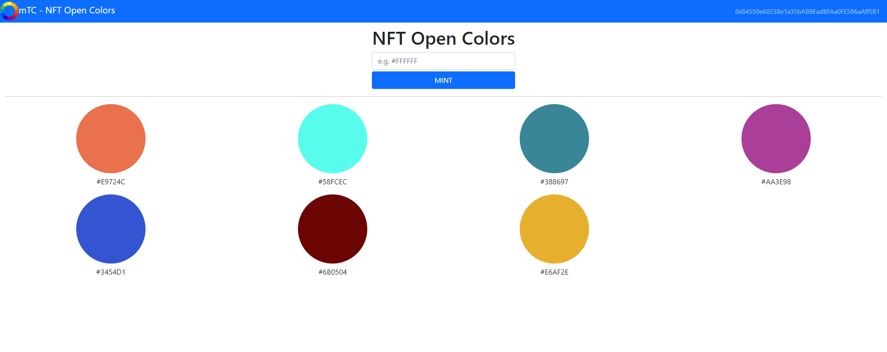

`#Ethereum`

# mTC - NFT Open Colors

This is an open platform, build with smart contracts powered by Ethereum which allows the end user to mint a unique NFT that represents a unique color.

## Table of Contents

- [Getting Started](#getting-started)
- [The Project](#the-project)
- [Resources](#resources)

## Getting Started

These instructions will get you a copy of the project up and running on your local machine for development and testing purposes.

### The repository

First, you will need to `clone` or `fork` the repository into your Github account:


```
$ git clone https://github.com/miquelTC/nft-colors.git
```

### Installing

First, you will need to install the dependencies with: `npm install`.

Run the following command in your terminal after cloning the main repo:

```
$ npm install
```

Then, you will need to install Truffle globally by running the following command int your terminal:

```
$ npm install -g truffle
```

### Running the Tests

First, you will have to compile the smart contracts by running the following command in your terminal:

```
$ truffle compile
```

Then you will have to install and run Ganache to run your blockchain locally:

https://www.trufflesuite.com/ganache

Then, the tests that validate your solution can be executed by runing the following
command:

```
$ truffle test
```

### Deployment on Local Blockchain

Deploy the contracts on your Ganache local blockchain by running the following command:

```
$ truffle migrate
```

### Opening the User Interface

First of all, it is required to install Metamask wallet as a browser extension: https://metamask.io/

Then you should configure Metamask to connect to your local blockchain run by Ganache. This requires the following:
- Open Metamask
- Open the Network Configuration panel
- Open Custom RPC
- Configure your private network by adding `http://localhost:7545` on the URL and `1337` as a chain ID.
- Import the first Ganache Account to Metamask by copying the Account Private Key from Ganache and pasting it on Metamask

Finally you just need to run the following command in your terminal to open the User Interface:

```
$ npm start
```

### Deployment on Public Network

In order to deploy your smart contract, you must create your .env file and specify:

- `PRIVATE_KEYS` --> Private Key of the account you are using to deploy (typically the first one in the list of Ganache)
- `INFURA_API_KEY` --> API key provided by Infura: https://infura.io

Then, you will need to run the following command (let's use the testnet Ropsten in this example, remember to request some Ether for your account using a faucet):

```
$ truffle migrate --network ropsten
```

Finally you can run the following command to generate the build artifacts of your User Interface and then deploy to your favourite host:

```
npm run build
```


### Technology stack

- `Solidity`
- `React.js`
- `Truffle`
- `Web3.js`
- `Ganache`
- `Node.js`
- `Metamask`

## The Project

This project is a DApp running on top of Ethereum, which allows the end user to chose a color and mint a unique NFT based on the chosen color. This unique NFT is included in this open collection and rendered in the screen.

- A smart contract which follows the ERC-721 standard and represents the NFT collection, tracking all the unique NFTs and its attributes.
- Tests built with JavaScripts to ensure the smart contract is accomplishing the expected functionalities.
- A React.js front-end application as a user interface.

### Project architecture


The user can access the application via web-browser, and he must have the Metamask wallet installed. This interface, built with React.js, relies on the web3.js library to communicate with the smart contracts through Metamask. This means that the data reflected on the front-end application is fetched from the Ethereum blockchain. Each NFT minted by the end user creates a transaction on Ethereum, which will require Metamask confirmation and pay an small fee, and this transaction will permanently modify the state of the smart contract.

### Project features



#### Mint

The user must input the desired color and simply click on the "Mint" button. This way, a NFT will be minted on the blockchain and the color will be visible in the screen from now on by anyone. Notice that the chosen color must be unique, otherwise the transaction will be rejected.


## Resources

- [ethereum.org](https://ethereum.org/)
- [truffle suit](https://www.trufflesuite.com/)
- [node.js](https://nodejs.org/)
- [web3.js](https://web3js.readthedocs.io/)
- [react.js](https://reactjs.org/)